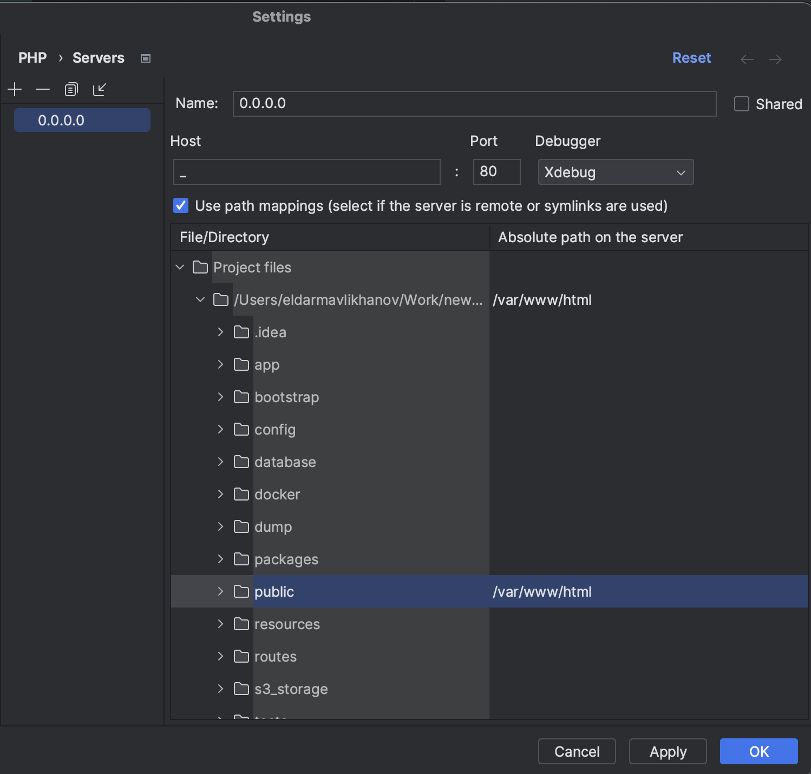

## Установка проекта

### 1. Установка Docker

- Установите [Docker Desktop][link-docker].

### 2. Подключение GIT

- Создайте (если надо) ssh-ключи
```
ssh-keygen
```
- Скопируйте публичный ключ
```
#для macos
cat ~/.ssh/id_rsa.pub | pbcopy 

#для UNIX
xclip -sel clip < ~/.ssh/id_rsa.pub 

#если ничего не подошло, вывести на экран и скопировать содержимое
cat ~/.ssh/id_rsa.pub
```
- Передайте скопированный ключ старшему разработчику, чтобы тот добавил его в настройки проекта

- Клонируйте репозиторий
```
git clone 
```

### 3. Работа с GIT

- В git проекта существуют три основные ветки:
    - **master** - боевой сайт
      Все доработки производятся в новой ветке, наследованной от master, название новой ветки = номер задачи в task-manager.
- **НЕ ДОПУСКАЕТСЯ** наследование от ветки `dev` и `stage` ни при каких обстоятельствах!

### 4. Обновление проекта из GIT

- После клонирования проекта у вас должна появиться ветка `master`, связанная с удаленной веткой `origin/master`
- Убедитесь, что вы находитесь в ветке `master` (например, если до этого работали с другой веткой)
- Получите последние изменения (`git pull`)
- Скопируйте файл `.env.example`, переименуйте его в `.env`
- Запустите сборку docker:
```
docker-compose up --build -d
```

### 5. Дамп бд

- Получите дамп баз и поместите его в директорию `dump/pg` и `dump/mongo`.
- Запустите следующую команду чтобы залить дамп в вашу бд
```
make restore-pg
make restore-mongo
```

### 6. Установка зависимостей composer

Установите соответствующие зависимости следующей командой:

```
docker-compose exec php-fpm composer install
```

### 7. Запуск миграций (создание и обновление структуры базы данных)

- Запустите следующую команду, дождитесь ее полного завершения (иногда это может занять продолжительное время):

```
docker-compose exec php-fpm php artisan migrate
```

### 8. Дополнительные команды artisan (необязательно)

- Генерация ключа приложения:

```
docker-compose exec php-fpm php artisan key:generate
```


- Очистка кэша и оптимизация:

```
docker-compose exec php-fpm php artisan optimize:clear
```

- Очистка очереди задач:

```
docker-compose exec php-fpm php artisan queue:clear
```

- Запуск обработчика очереди задач:

```
docker-compose exec php-fpm php artisan queue:work
```

### 9. Пример получения свежих изменений

```
git checkout master
git pull
docker-compose exec php-fpm composer install
docker-compose exec php-fpm php artisan migrate
```

### 10. Завершение задачи

- После завершения задачи, нужно убедиться, что нет лишних комментариев, кусков дебага и тд
- Запустить линтер

```
docker-compose exec php-fpm composer lint
```

- Запустить phpstan. Если phpstan выведет ошибки, ошибки нужно пофиксить, задачу еще раз перепроверить и повторно запустить линтер

```
docker-compose exec php-fpm composer phpstan
```

- Также следует запускать команду, по регенерации хелперов модели

```
docker-compose exec php-fpm php artisan ide-helper:models "\Modules\Path\To\Model"
```

### 11. Доступ к сайту

- Сайт доступен по адресу:

```
http://localhost
```

- Swagger

```
http://127.0.0.1:8100/swaggerautowallet/
```

### 12. Makefile команды

В корне проекта есть Makefile с основными вспомогательными командами
```shell
➜ make
Available commands:
  restore-pg        Restore from backup (postgre).
  restore-mogno     Restore from backup (mongo).
  xdebug            Enable xdebug
  test              Run tests
  test-coverage     Run tests coverage
```

### 13. Настройка PhpStorm

#### Настройка Xdebug

- Выполнить команду

```
make xdebug
```

- Перейти в настройки (cmd + ,) (cntl + ,) (PhpStorm->Settings)
- Перейти в раздел php -> cli interpreter -> ...
- - нажать +
- - выбрать: From Docker ...
- - выбрать Docker
- - в Image name: должно подставиться "pavlov-mcru-php-fpm:latest"
- - Нажать OK
- - в Debugger extension указать путь: /usr/local/lib/php/extensions/no-debug-non-zts-20180731/xdebug.so
- - Нажать Apply, OK
- Перейти в раздел php (выпадающий список) -> Servers -> +
  
- Сохранить

#### Настройка PHP CS Fixer

- Перейти в настройки (cmd + ,) (cntl + ,) (PhpStorm->Settings)
- Перейти в раздел php (выпадающий список) -> Quality Tools -> PHP CS Fixer
- Перевести тумблер в ON
- Configuration выбрать: pavlov-mcru-php-fpm:latest
- Путь к cs-fixer: /opt/project/.php-cs-fixer.php
- Сохранить


### Прочее
- Репозиторий с бд авто https://github.com/blanzh/carsBase
- Войти в докер образ:
```
 docker exec -it auto_wallet_app-php-fpm-1 bash
```

[link-laravel]: https://laravel.com/docs
[link-docker]: https://www.docker.com/products/docker-desktop/
